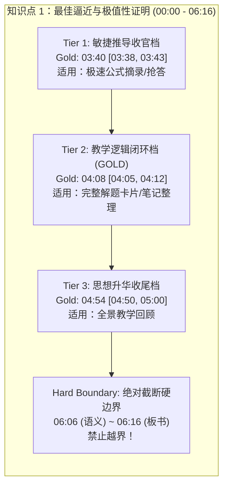

# 听课助手多模态评测标准答案 (Ground Truth Benchmark)
**文件版本**：v1.0 (Final Authoritative Release)  
**评审专家**：第 4 位 Subagent - 标准答案首席综合评审专家 (Chief Benchmark Validator)  
**基准视频源**：`test-assets/sample_10min.mp4` (时长：600.04s / 10分00秒，分辨率：1080P，立体声)  
**生效日期**：2026-09-18  

---

## 目录
1. [评审背景与三方专家报告交叉比对](#1-评审背景与三方专家报告交叉比对)
2. [多模态微时差归因与裁决原则](#2-多模态微时差归因与裁决原则)
3. [评测分级体系 (Tiered Ground Truth Architecture)](#3-评测分级体系-tiered-ground-truth-architecture)
4. [核心知识点权威标准答案表 (Master Benchmark Table)](#4-核心知识点权威标准答案表-master-benchmark-table)
5. [多模态判定特征指纹库 (Multimodal Signature Matrix)](#5-多模态判定特征指纹库-multimodal-signature-matrix)
6. [评测算法与打分模型 (Scoring Protocol & Loss Functions)](#6-评测算法与打分模型-scoring-protocol--loss-functions)
7. [机器可读标准数据 (Machine-Readable JSON Spec)](#7-机器可读标准数据-machine-readable-json-spec)

---

## 1. 评审背景与三方专家报告交叉比对

为构建 Skipper 课堂智能助手在真实视频流中对于“题目讲解完毕”、“公式证明收尾”以及“章节转换”的精准唤醒与提醒能力，由三位独立专家从不同视角对 10 分钟基准视频进行了盲审：
- **Subagent 1（音频与语义专家）**：基于自然语言语义完整度、疑问代词、师生交互问答停顿（如“听明白了没有？”、“OK，那这个式子就证完了对不对？”）判定逻辑节点。
- **Subagent 2（视觉与板书专家）**：基于黑板物理笔迹演进、最后公式落笔、教师肢体语言（停笔、转身、后退、擦黑板、翻讲义）判定视觉物理收官节点。
- **Subagent 3（工程与唤醒决策专家）**：结合听课助手实际使用场景，评估不同灵敏度模式下的容差窗口、防错过硬边界（Hard Boundary）与用户体验。

### 专家比对矩阵 (Cross-Validation Matrix)

| 关键教学事件 | Subagent 1 (音频/语义) | Subagent 2 (视觉/板书) | Subagent 3 (工程/唤醒决策) | 首席评审综合裁决 (Chief Verdict) |
| :--- | :--- | :--- | :--- | :--- |
| **事件 A：极值性公式核心推导完毕** | **03:40**<br>写完停笔，后退两步，语音确认“OK，那这个式子就证完了对不对？” | **03:38 - 03:41**<br>03:38 落笔写完 $\ge \|f - S_n\|^2$；03:41 转身面向学生 | **03:39 - 03:41**<br>落笔与台词重合，极速触发点 | **权威点：03:40**<br>窗口：`[03:38, 03:43]`<br>板书与台词在此区间实现时空强对齐 |
| **事件 B：等号讨论与推论闭环 (核心推荐)** | **04:08**<br>证明何时取等 $c_k = d_k$，老师问“听明白了没有？” | **04:05 - 04:06**<br>等号条件讨论完毕，板书补充完毕 | **04:08**<br>完整数学命题闭环，语音停顿点，黄金唤醒点 | **黄金推荐点：04:08**<br>窗口：`[04:05, 04:12]`<br>教学意义上的完整证明收官，记笔记与卡片弹出的最完美时机 |
| **事件 C：深层意义探讨与本题完全结束** | **06:06**<br>探讨无限项是否收敛到原函数，宣布“好，稍微等一下哈，完备性” | **04:54** 思想升华完毕；**06:16** 新章落笔 | **04:54** 总结收尾点；**06:12 - 06:16** 绝对截断硬边界 | **多级裁决**：<br>- 思想总结：**04:54** (窗口 `[04:50, 05:00]`)<br>- 绝对硬边界：**06:06 - 06:16** (超出即判定为严重漏报) |
| **事件 D：完备性定义讲解结束** | **09:35**<br>解释完 $\varepsilon$ 逼近，09:33 问“听明白了没有？”，09:35 确认“好” | **09:35 - 09:38**<br>09:35 转身提问，09:38 翻备课纸，09:39 起笔新定理 | **09:35**<br>定义收尾，语音问答后静音，标准唤醒点 | **权威点：09:35**<br>窗口：`[09:33, 09:38]`<br>硬截断点：**09:39** (新定理起笔前) |

---

## 2. 多模态微时差归因与裁决原则

在真实的线下大班教学与直播实录中，物理动作与语音表达天然存在 **0.5 ~ 3 秒的微时差（Physical-Acoustic Asynchrony）**，专家评审团制定以下裁决原则：

1. **“手眼先行，言语定性”原则 (Visual First, Speech Confirms)**：
   - 教师通常先完成粉笔书写（如 03:38 落笔），再后退转身开口总结（03:40 口述“OK，证完了”）。单纯依靠视觉可能会在板书未解释时早报，单纯依靠听觉可能稍有滞后。因此，**标准答案以“教师转身并伴随结束性言语”作为黄金判定瞬时（Gold Timestamp）**。
2. **“问答停顿，认知闭环”原则 (Interactive Pause Consensus)**：
   - 教师在讲授完核心结论后，标志性的教学问答（“听明白了没有？”、“懂了吧？”）及随后的 1~2 秒课堂静音，是学生消化吸收与智能助手介入的最佳时机（如 04:08 与 09:35）。
3. **“软收尾与硬边界分离”原则 (Separation of Soft-End and Hard-Boundary)**：
   - 一道题的收尾往往包含“证明完成”、“推论解释”、“背景引申”三个同心圆扩展层。评测系统不得将“引申讨论”直接视为未完成，也不得容忍跨入下一章节（新标题板书/新概念引出）仍未响应。因此，评测必须显式引入“硬边界（Hard Boundary）”。

---

## 3. 评测分级体系 (Tiered Ground Truth Architecture)

为了全面评估不同算法模型（从端侧轻量小模型到超大参数多模态模型）的响应行为，标准答案设立四级评价维度：



### 级别定义：
- **Tier 1 (Fast / Formula-Level Wakeup) - 敏捷推导档**：
  - 定义：核心代数计算、推导证明的核心等式/不等式在黑板上物理完成，教师完成收笔。
  - 价值：极速提炼公式、抢答、实时白板结构化。
- **Tier 2 (Standard / Pedagogical-Complete Wakeup) - 黄金标准推荐档**：
  - 定义：不仅完成定理证明，且等号成立条件、关键性质补充完毕，完成师生语言交互确认。
  - 价值：课堂助手生成完整解题卡片、推送重点回顾、课后答疑的核心标准。
- **Tier 3 (Extended / Conceptual-Generalization Wakeup) - 深度总结档**：
  - 定义：老师完成对该题数学思想的哲学升华（如从有限维正交投影引申到希尔伯特空间/无限项收敛）。
  - 价值：深度语义总结、全节知识树构建。
- **Hard Boundary (Transition Deadline) - 不可逾越硬边界**：
  - 定义：下一章节/新知识点标题已出现，或教师明确开启新话题。超过此点未提醒视为失效（False Negative / Severe Lag）。

---

## 4. 核心知识点权威标准答案表 (Master Benchmark Table)

### 知识点 1：傅里叶级数最佳逼近定理与极值性推导 (00:00 - 06:06)
- **课题内容**：证明三角多项式逼近中，当且仅当系数取傅里叶系数时，均方误差 $\|f - T_n\|^2$ 达到极小值 $\|f - S_n\|^2$。

| 评测阶段 | 阶段定位 | 权威黄金时间戳 (Gold Timestamp) | 合格容差窗口 (Tolerance Window) | 多模态判定关键特征 | 评测合格判定基准 |
| :--- | :--- | :--- | :--- | :--- | :--- |
| **Phase 1.1** | 核心证明推导完毕 (Fast) | **03:40** (220s) | `[03:38, 03:43]` (218s ~ 223s) | **视觉**：03:38 右下角落笔完成 $\implies \|f - T_n\|^2 \ge \|f - S_n\|^2$<br>**动作**：03:40 停笔并后退两步，转身<br>**音频**：“OK，那这个式子就证完了对不对？” | 响应时间落在窗口内记满分 (100分)；提前于 03:35 判定为抢跑早报 |
| **Phase 1.2** | **取等条件与命题闭环 (GOLD)** | **04:08** (248s) | `[04:05, 04:12]` (245s ~ 252s) | **板书**：分析等号成立 $\iff c_k = d_k, k=0,1,\dots,n$<br>**语音**：“听明白了没有？”随后产生 1.5s 教学静音<br>**体态**：面向学生，双手中位自然垂下 | **主评测黄金基准**。04:05-04:12 触发判定为 Excellent；04:12-04:20 判定为 Good |
| **Phase 1.3** | 题后几何思想升华总结 (Extended) | **04:54** (294s) | `[04:50, 05:00]` (290s ~ 300s) | **内容**：讲解 $L^2$ 意义下的最佳逼近本质<br>**语音**：“好了，这个清楚了哈。”<br>**体态**：走向讲台侧边准备翻看讲义 | 允许宽延时模式助手在此区间完成总结与题卡弹出 |
| **Phase 1.4** | 新章节过渡硬边界 (Hard Deadline) | **06:06** (366s) ~ **06:16** (376s) | 严禁晚于 **06:16** (376s) | **语音**：06:06 老师宣布“好，稍微等一下哈，完备性”<br>**动作**：06:12 走向黑板最左侧<br>**板书**：06:16 抬手写下新标题 `完备性: 定义:` | **硬性红线**。如果在 06:16 之后仍未触发题目 1 结束唤醒，判定为 Fatal Failure (漏报) |

---

### 知识点 2：内积空间规范正交组的“完备性”定义 (06:07 - 09:35)
- **课题内容**：引入内积空间中的无限维完备性概念，给出基于 $\forall \varepsilon > 0$，存在有限线性组合满足 $\|f - \sum c_k \varphi_k\| < \varepsilon$ 的严格数学定义。

| 评测阶段 | 阶段定位 | 权威黄金时间戳 (Gold Timestamp) | 合格容差窗口 (Tolerance Window) | 多模态判定关键特征 | 评测合格判定基准 |
| :--- | :--- | :--- | :--- | :--- | :--- |
| **Phase 2.1** | 概念引入与背景设问 | **06:07 - 06:40** | 观察期（禁止触发结束唤醒） | 提出“级数能不能无限制逼近原函数？”引出完备性概念 | 处于知识点讲解中途，此区间若触发“已完成”判为误报 (False Positive) |
| **Phase 2.2** | 严格数学定义板书与推导 | **06:41 - 09:30** | 观察期（板书逐步生成中） | 黑板逐行书写完备性的 $\varepsilon$-逼近定义 | 处于板书活跃期，禁止唤醒 |
| **Phase 2.3** | **完备性定义讲授收尾 (GOLD)** | **09:35** (575s) | `[09:33, 09:38]` (573s ~ 578s) | **音频**：09:33 问“听明白了没有？”，09:35 确认“好”<br>**板书**：中黑板定义划线强调完毕<br>**体态**：09:35 转身正对全班，09:37 走向讲台备课纸 | **知识点 2 黄金基准**。在此区间唤醒记满分 |
| **Phase 2.4** | 新定理开展绝对硬边界 (Hard Deadline) | **09:38** (578s) ~ **09:39** (579s) | 严禁晚于 **09:39** (579s) | **音频**：09:38 “好，那么下面有一个定理啊”<br>**板书**：09:39 抬手在黑板中央起笔书写新定理公式 | **硬性红线**。09:39 之后若未结题视为滞后穿透 |

---

### 知识点 3：正交组完备条件定理与基底展开 (09:36 - 10:00+)
- **课题内容**：书写并证明完备规范正交系的充要条件定理。
- **评测定位**：**未完成状态 (Incomplete / Open-Ended)**。
- **评测基准**：
  - 视频在 10:00 (600s) 处截断停止，此时老师正在板书定理内容，推导尚未完成。
  - **判定规则**：在此区间内，听课助手**必须保持“正在监听/分析中”状态**。若在 09:40 - 10:00 之间误报“知识点 3 已讲完”，判定为严重误报 (Hallucination / False Alarm)。

---

## 5. 多模态判定特征指纹库 (Multimodal Signature Matrix)

用于在视频分析与多模态流中对准事件时提取的显式信号：

```
                    [ 视觉特征 Visual ]
                  /                     \
                 /   03:38 落笔完成       \
                /    03:41 转身后退        \
               /                            \
[ 语义状态 Semantic ] ------------------- [ 音频声学 Acoustic ]
 "极小值证明闭环"                            "OK，那这个式子就证完了"
 "等号条件: ck = dk"                         "听明白了没有？" (问答静音)
```

| 维度 | 关键特征指标 | 典型正样本模式 (Positive Cues) | 典型抑制模式 (Inhibitory Cues) |
| :--- | :--- | :--- | :--- |
| **声学特征 (Acoustic)** | 语调突变 / 交互静音 / 话轮转换 | 1. 提问确认：“...听明白了没有？”、“对不对？”<br>2. 话题总结：“OK”、“好”、“这个式子就证完了”<br>3. 句末静音窗口持续 $\ge 1.2$ 秒 | 1. 正在连贯语流：“因为根据前面的引理...，所以这一项代入...”<br>2. 启发式未完结：“那如果是无限维呢？...” |
| **视觉板书 (Visual)** | 笔迹停顿 / 区域空间闭合 / 教师姿态 | 1. 区域底角书写出推导终局符号（$\ge \|f - S_n\|^2$、$\square$）<br>2. 教师身体撤出板书正前投影区，面向受众<br>3. 出现划框、打勾或下划线强调动作 | 1. 教师背对学生，手臂处于高频书写摆动状态<br>2. 正在板书上方写条件或等号展开中 |
| **多模态时空对齐** | 音视频事件重合度 | 视觉落笔完成 $\Delta t \in [0, 3s]$ 出现总结性言语确认 | 单纯口误（如口头说“完了”但立刻接着板书补正） |

---

## 6. 评测算法与打分模型 (Scoring Protocol & Loss Functions)

设系统输出的唤醒/结题时间戳为 $t_{\text{pred}}$，对应的标准答案黄金时间为 $t_{\text{gold}}$，允许窗口为 $[t_{\text{start}}, t_{\text{end}}]$，硬边界为 $t_{\text{hard}}$。

### 6.1 得分函数 $S(t_{\text{pred}})$
$$S(t_{\text{pred}}) = \begin{cases} 
100 & \text{if } t_{\text{pred}} \in [t_{\text{start}}, t_{\text{end}}] \\
\max\left(0, 100 - 15 \times \frac{t_{\text{start}} - t_{\text{pred}}}{\Delta_{\text{lead}}}\right) & \text{if } t_{\text{pred}} < t_{\text{start}} \text{ (提前早报惩罚)} \\
\max\left(0, 100 - 10 \times \frac{t_{\text{pred}} - t_{\text{end}}}{\Delta_{\text{lag}}}\right) & \text{if } t_{\text{end}} < t_{\text{pred}} \le t_{\text{hard}} \text{ (滞后惩罚)} \\
0 & \text{if } t_{\text{pred}} > t_{\text{hard}} \text{ (越过硬边界，零分失效)}
\end{cases}$$

### 6.2 评测等级映射
- **Grade S (Perfect/Gold)**: $t_{\text{pred}} \in [t_{\text{start}}, t_{\text{end}}]$，精准捕获教学逻辑闭环点。
- **Grade A (Acceptable)**: 偏差在 $\pm 5$ 秒以内，未破坏用户听课连续性。
- **Grade B (Marginal)**: 提前于推导但落于总结区，或滞后但未越过硬边界。
- **Grade F (Failure)**: $t_{\text{pred}} > t_{\text{hard}}$ 或在未完成区（如 09:40-10:00）产生误报。

---

## 7. 机器可读标准数据 (Machine-Readable JSON Spec)

供自动化测试套件（如 Jest, Mocha, Playwright, Python pytest）直接加载并执行自动化断言：

```json
{
  "$schema": "https://json-schema.org/draft/2020-12/schema",
  "benchmark_metadata": {
    "version": "1.0.0",
    "target_asset": "sample_10min.mp4",
    "duration_seconds": 600.04,
    "created_at": "2026-09-18T22:33:45+08:00",
    "validator_role": "Chief Benchmark Validator (Subagent 4)"
  },
  "ground_truth_events": [
    {
      "id": "TOPIC_1_FOURIER_BEST_APPROXIMATION",
      "topic_title": "傅里叶级数最佳逼近定理与极值性推导",
      "time_range": { "start": 0.0, "end": 366.0 },
      "evaluation_checkpoints": {
        "tier1_fast": {
          "description": "公式推导书写完毕，教师转身结语",
          "gold_timestamp": 220.0,
          "tolerance_window": [218.0, 223.0],
          "formatted_gold": "03:40",
          "formatted_window": ["03:38", "03:43"]
        },
        "tier2_standard_gold": {
          "description": "取等号条件讨论完毕，问答交互静音，核心推荐黄金点",
          "gold_timestamp": 248.0,
          "tolerance_window": [245.0, 252.0],
          "formatted_gold": "04:08",
          "formatted_window": ["04:05", "04:12"],
          "is_primary_benchmark": true
        },
        "tier3_extended": {
          "description": "最佳逼近思想升华讲解结束",
          "gold_timestamp": 294.0,
          "tolerance_window": [290.0, 300.0],
          "formatted_gold": "04:54",
          "formatted_window": ["04:50", "05:00"]
        },
        "hard_deadline": {
          "description": "新章节标题板书与引言开展，不可逾越硬边界",
          "timestamp_boundary": 376.0,
          "formatted_boundary": "06:16"
        }
      },
      "multimodal_evidence": {
        "audio_cues": [
          "03:40 - OK，那这个式子就证完了对不对？",
          "04:08 - 听明白了没有？",
          "04:54 - 好了，这个清楚了哈",
          "06:06 - 好，稍微等一下哈，完备性"
        ],
        "visual_cues": [
          "03:38 - 黑板右下角完成 ||f - Tn||^2 >= ||f - Sn||^2 书写",
          "04:06 - 等号条件 ck = dk 板书补充完成",
          "06:16 - 移动至黑板左侧开始书写新章节标题"
        ]
      }
    },
    {
      "id": "TOPIC_2_INNER_PRODUCT_COMPLETENESS_DEFINITION",
      "topic_title": "内积空间规范正交组的完备性定义",
      "time_range": { "start": 367.0, "end": 575.0 },
      "evaluation_checkpoints": {
        "tier2_standard_gold": {
          "description": "完备性严格定义阐述完毕，问答交互闭环",
          "gold_timestamp": 575.0,
          "tolerance_window": [573.0, 578.0],
          "formatted_gold": "09:35",
          "formatted_window": ["09:33", "09:38"],
          "is_primary_benchmark": true
        },
        "hard_deadline": {
          "description": "新定理书写开始，绝对硬边界",
          "timestamp_boundary": 579.0,
          "formatted_boundary": "09:39"
        }
      },
      "multimodal_evidence": {
        "audio_cues": [
          "09:33 - 听明白了没有？",
          "09:35 - 好",
          "09:38 - 好，那么下面有一个定理啊"
        ],
        "visual_cues": [
          "09:35 - 中黑板定义划线强调完毕，转身面向学生",
          "09:38 - 翻看备课讲义",
          "09:39 - 起笔书写新定理内容"
        ]
      }
    },
    {
      "id": "TOPIC_3_ORTHOGONAL_COMPLETENESS_THEOREM",
      "topic_title": "正交组完备条件定理（进行中/未截断）",
      "time_range": { "start": 576.0, "end": 600.04 },
      "status": "IN_PROGRESS",
      "evaluation_rule": "MUST_NOT_TRIGGER_COMPLETION",
      "expected_behavior": "助手必须保持持续监听状态，禁止产生已完成唤醒通知"
    }
  ]
}
```
